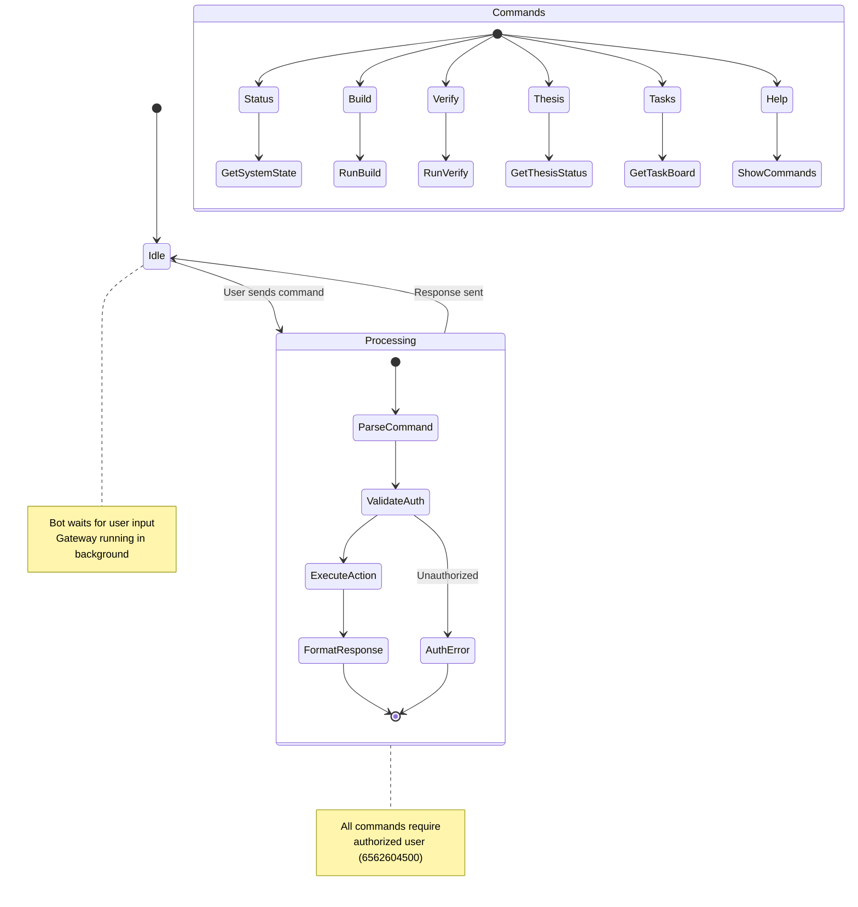
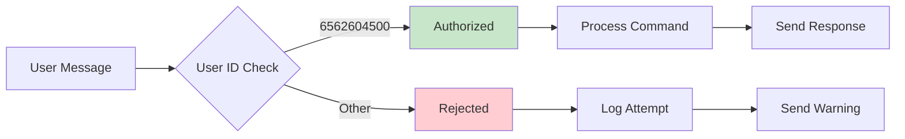

# CrossFlow Bot Status Flow

## Overview
The CrossFlow bot (@ElBayadhDSSBot) provides real-time status updates for the Logistics DSS project via Telegram.

## Status Flow Diagram



## Command Flow

```mermaid
flowchart TD
    A[User Message] --> B{Parse Command}
    B --> C[/status]
    B --> D[/build]
    B --> E[/verify]
    B --> F[/thesis]
    B --> G[/tasks]
    B --> H[/help]
    B --> I[Unknown]
    
    C --> C1[Get System State]
    C1 --> C2[ERP Version]
    C1 --> C3[Verify Status]
    C1 --> C4[Thesis Status]
    C1 --> C5[Bot Status]
    C2 --> C6[Format Response]
    C3 --> C6
    C4 --> C6
    C5 --> C6
    C6 --> C7[Send to Telegram]
    
    D --> D1[Run build.ps1]
    D1 --> D2[Capture Output]
    D2 --> D3[Format Response]
    D3 --> C7
    
    E --> E1[Run verify.ps1]
    E1 --> E2[Parse Results]
    E2 --> E3[Format Response]
    E3 --> C7
    
    F --> F1[Check Thesis Files]
    F1 --> F2[Get Build Status]
    F2 --> F3[Format Response]
    F3 --> C7
    
    G --> G1[Read opus-tasks.md]
    G1 --> G2[Count DONE/PENDING]
    G2 --> G3[Format Response]
    G3 --> C7
    
    H --> H1[Show Available Commands]
    H1 --> C7
    
    I --> I1[Show Help]
    I1 --> C7
    
    style A fill:#e1f5fe
    style C7 fill:#c8e6c9
    style AuthError fill:#ffcdd2
```

## Status Response Format

```
📊 CrossFlow Status — El Bayadh DSS
━━━━━━━━━━━━━━━━━━━━━━━━━━━━━━━━━

🔧 ERP System
  Version: v13.3
  Workbook: ERP_v13.3.xlsm
  Verify: 112/112 PASS

📄 Thesis
  Arabic: v13.3 (1.5 MB PDF)
  English: IEEE format (70 KB PDF)
  CCA'2026: Submitted

🤖 Bot
  Gateway: Running
  Hermes: v0.15.1
  OCR: Tesseract ready

📋 CrossFlow Tasks
  DONE: 6/6
  PENDING: 0

⏰ Last updated: {timestamp}
```

## Security Flow



## Integration Points

1. **CLI → Bot**: Status updates from OpenCode CLI pushed to Telegram
2. **Bot → CLI**: Commands from Telegram trigger CLI actions
3. **Knowledge Base**: Bot queries FTS5 search for quick answers
4. **Task Board**: Bot reads opus-tasks.md for task status
5. **OCR Reader**: Bot can trigger OCR and return results

## Auto-Status Updates

The bot can send periodic status updates:
- **Every hour**: System health check
- **On build**: Build completion notification
- **On verify**: Verify results summary
- **On task completion**: Task status update
