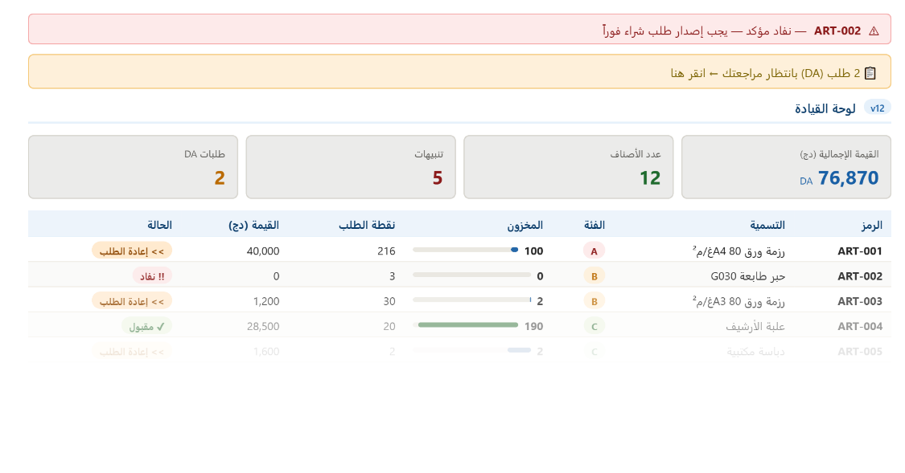

**[الجمهورية الجزائرية الديمقراطية الشعبية]{dir="rtl"}**

[وزارة التكوين والتعليم المهنيين**\
المعهد الوطني المتخصص في التكوين المهني\
بن سعيدي عبد العاطي --- البيض\
**]{dir="rtl"}

**[مذكرة نهاية التربص]{dir="rtl"}**

[لنيل شهادة تقني سامي في تسيير المخزونات واللوجستيك\
**\
بناء نظام لإتمام دورة الشراء والتخزين**]{dir="rtl"}

**[دراسة حالة: مديرية التربية -- البيض]{dir="rtl"} -[\
\
]{dir="rtl"}**

**[\
]{dir="rtl"}\
[\
]{dir="rtl"}Building a System to Complete the Purchasing and Warehousing
Cycle - Case Study: Directorate of Education - El Bayadh[\
]{dir="rtl"}\
**

**[\
]{dir="rtl"}**

[**إعداد الطالب: ماحي كمال عبد الغني** **إشراف الأستاذة: دهيني
ميمونة**]{dir="rtl"}

**[دورة أكتوبر 2025]{dir="rtl"}**

**[إهداء]{dir="rtl"}**

[أُهدي ثمرةَ هذا الجهد المتواضع إلى والديَّ الكريمَين اللذَين لم يبخلا عليَّ
يوماً بالدعم والحنان والتشجيع، وإلى كل من أضاء دربي من أساتذة ومشرفين
وزملاء طوال مسيرتي التكوينية.]{dir="rtl"}

[وإلى كل مَن آمن بأن التكنولوجيا أداةٌ لخدمة الإدارة الجزائرية وتطويرها،
وإلى كل من يؤمن بأن الرقمنة ليست ترفاً بل ضرورة تشغيلية.]{dir="rtl"}

**[شكر وتقدير]{dir="rtl"}**

[أتقدم بجزيل الشكر والعرفان إلى الأستاذة المشرفة دهيني ميمونة التي لم
تبخل بتوجيهاتها ونصائحها القيِّمة في جميع مراحل إعداد هذا
العمل.]{dir="rtl"}

[كما أتوجه بالشكر الجزيل إلى إطارات المعهد الوطني المتخصص في التكوين
المهني بن سعيدي عبد العاطي بالبيض على ما أبدوه من دعم لوجستي ومنهجي طوال
فترة التكوين.]{dir="rtl"}

[وأخص بالذكر السيد مسؤول مصلحة المخازن بمديرية التربية لولاية البيض الذي
أتاح لنا فرصة التربص وفتح لنا أبواب المعرفة الميدانية، وقدَّم لنا كل
التسهيلات الضرورية لإنجاز هذا البحث.]{dir="rtl"}

[وإلى لجنة المناقشة الموقرة على تفضُّلها بقراءة هذا العمل
وتقييمه.]{dir="rtl"}

**[ملخص]{dir="rtl"}**

[تُعالج هذه المذكرة إشكاليةَ تسيير المخزون في المؤسسات العمومية، وتتخذ من
مخزن مديرية التربية لولاية البيض ميداناً للدراسة التطبيقية. ينطلق البحث
من تشخيص النظام اليدوي القائم، ويرصد أوجه القصور فيه: تكرار نفاد
المخزون، وغياب التتبع الآني، وطول مدة الجرد الدوري. يُقترح كحل نظام Mini
ERP مبني بـ Microsoft Excel وVisual Basic for Applications (VBA) إضافةً
إلى محرك معالجة خلفي بلغة Python، يُوحِّد دورة الشراء والتخزين ضمن بيئة
رقمية متكاملة، مع تفعيل الجرد الدائم وآليات التنبيه الآلي عند بلوغ نقطة
إعادة الطلب ROP. خلصت الدراسة إلى أن النظام المقترح (Academix v13.1) حقَّق
تخفيضاً بنسبة 97% في زمن معالجة الحركات، وأرسى تطابقاً تاماً بين الرصيد
المحاسبي والفيزيائي، وأثبت الفرضيتَين بأدلة كمية ميدانية. تكلفة التطبيق
صفرية إذ يعتمد أدوات Office المتاحة مسبقاً في الإدارة
الجزائرية.]{dir="rtl"}

*[الكلمات المفتاحية: تسيير المخزون --- Mini ERP --- Excel/VBA --- جرد
دائم --- تحليل ABC --- نموذج ويلسون --- CMUP --- مديرية التربية ---
ولاية البيض]{dir="rtl"}*

**Résumé**

Ce mémoire traite de la problématique de la gestion des stocks dans les
établissements publics, en prenant pour terrain d\'étude le magasin de
la Direction de l\'Éducation de la wilaya d\'El Bayadh. À partir d\'un
diagnostic du système manuel existant --- ruptures récurrentes, absence
de traçabilité, inventaires chronophages --- il propose la construction
d\'un système Mini ERP sous Excel/VBA doté d\'un moteur Python (Academix
v13.1), automatisant le cycle achat-stockage et renforçant l\'inventaire
permanent par des alertes intelligentes basées sur le Point de
Réapprovisionnement (ROP).

*Mots-clés : Gestion des stocks --- Mini ERP --- Excel/VBA ---
Inventaire permanent --- Analyse ABC --- Modèle de Wilson --- Direction
de l\'Éducation --- El Bayadh*

**[قائمة المختصرات والرموز]{dir="rtl"}**

  ----------------------------------------------------------------------------
  [الرمز]{dir="rtl"}   [المعنى بالفرنسية /            [المعنى
                       الإنجليزية]{dir="rtl"}         بالعربية]{dir="rtl"}
  -------------------- ------------------------------ ------------------------
  [ERP]{dir="rtl"}     [Enterprise Resource           [نظام تخطيط موارد
                       Planning]{dir="rtl"}           المؤسسة]{dir="rtl"}

  [VBA]{dir="rtl"}     [Visual Basic for              [لغة الأتمتة في
                       Applications]{dir="rtl"}       Microsoft
                                                      Office]{dir="rtl"}

  [EOQ /               [Economic Order                [الكمية الاقتصادية
  Q\*]{dir="rtl"}      Quantity]{dir="rtl"}           المثلى]{dir="rtl"}

  [ROP]{dir="rtl"}     [Reorder Point]{dir="rtl"}     [نقطة إعادة
                                                      الطلب]{dir="rtl"}

  [SS]{dir="rtl"}      [Safety Stock]{dir="rtl"}      [مخزون
                                                      الأمان]{dir="rtl"}

  [FIFO]{dir="rtl"}    [First In, First               [أول دخول أول
                       Out]{dir="rtl"}                خروج]{dir="rtl"}

  [CMUP]{dir="rtl"}    [Coût Moyen Unitaire           [المتوسط المرجَّح للتكلفة
                       Pondéré]{dir="rtl"}            الوحدوية]{dir="rtl"}

  [CVT]{dir="rtl"}     [Coût Variable                 [إجمالي التكاليف
                       Total]{dir="rtl"}              المتغيرة]{dir="rtl"}

  [KPI]{dir="rtl"}     [Key Performance               [مؤشر الأداء
                       Indicator]{dir="rtl"}          الرئيسي]{dir="rtl"}

  [ABC]{dir="rtl"}     [Analyse ABC                   [تصنيف باريتو
                       (Pareto)]{dir="rtl"}           الثلاثي]{dir="rtl"}

  [DA]{dir="rtl"}      [Demande d\'Achat]{dir="rtl"}  [طلب الشراء
                                                      الداخلي]{dir="rtl"}

  [BC]{dir="rtl"}      [Bon de Commande]{dir="rtl"}   [أمر الشراء]{dir="rtl"}

  [BR]{dir="rtl"}      [Bon de Réception]{dir="rtl"}  [وصل
                                                      الاستلام]{dir="rtl"}

  [BS]{dir="rtl"}      [Bon de Sortie]{dir="rtl"}     [وصل الإخراج]{dir="rtl"}

  [LT]{dir="rtl"}      [Lead Time]{dir="rtl"}         [أجل التسليم]{dir="rtl"}

  [D]{dir="rtl"}       [Demande Annuelle]{dir="rtl"}  [الطلب
                                                      السنوي]{dir="rtl"}

  [CoV]{dir="rtl"}     [Coefficient of                [معامل
                       Variation]{dir="rtl"}          التباين]{dir="rtl"}
  ----------------------------------------------------------------------------

**[قائمة الجداول]{dir="rtl"}**

[**جدول 01 :** مقارنة طرق تقييم المخزون (FIFO / LIFO / CMUP)
*\...\...\...\...\... الفصل الأول*]{dir="rtl"}

[**جدول 02 :** تطبيق CMUP --- مثال توضيحي منهجي على مادة رزم الورق A4
*\...\...\...\...\... الفصل الأول*]{dir="rtl"}

[**جدول 03 :** شبكة تقييم الموردين بنظام التنقيط المرجَّح
*\...\...\...\...\... الفصل الأول*]{dir="rtl"}

[**جدول 04 :** نقاط الضعف الهيكلية في مخزن مديرية التربية
*\...\...\...\...\... الفصل الثاني*]{dir="rtl"}

[**جدول 05 :** تصنيف ABC لمواد مخزن مديرية التربية *\...\...\...\...\...
الفصل الثالث*]{dir="rtl"}

[**جدول 06 :** معاملات نموذج ويلسون المُعتمَدة --- رزم الورق A4
*\...\...\...\...\... الفصل الثالث*]{dir="rtl"}

[**جدول 07 :** تحليل مقارن لبدائل الحل التقني *\...\...\...\...\...
الفصل الثالث*]{dir="rtl"}

[**جدول 08 :** سلسلة الحراسة السداسية في Academix v13.1
*\...\...\...\...\... الفصل الثالث*]{dir="rtl"}

[**جدول 09 :** تسلسل عمليات المحرك الخلفي لكل حركة مخزون
*\...\...\...\...\... الفصل الثالث*]{dir="rtl"}

[**جدول 10 :** لوحة ألوان واجهة Academix v13.1 *\...\...\...\...\...
الفصل الثالث*]{dir="rtl"}

[**جدول 11 :** التصنيف المزدوج ABC-XYZ لصنف Toner G030
*\...\...\...\...\... الفصل الرابع*]{dir="rtl"}

[**جدول 12 :** معاملات نموذج ويلسون لصنف Toner G030
*\...\...\...\...\... الفصل الرابع*]{dir="rtl"}

[**جدول 13 :** مقارنة الكفاءة الزمنية: الدورة الورقية مقابل الدورة
الرقمية *\...\...\...\...\... الفصل الرابع*]{dir="rtl"}

[**جدول 14 :** مقارنة دقة البيانات: النظام اليدوي مقابل Academix v13.1
*\...\...\...\...\... الفصل الرابع*]{dir="rtl"}

[**جدول 15 :** مقارنة نمط اتخاذ قرار الطلب: ما قبل وما بعد التطبيق
*\...\...\...\...\... الفصل الرابع*]{dir="rtl"}

[**جدول 16 :** مقارنة مخاطر النفاد للأصناف الحساسة (Class A)
*\...\...\...\...\... الفصل الرابع*]{dir="rtl"}

**[مقدمة عامة]{dir="rtl"}**

> **[1. السياق العام]{dir="rtl"}**

[يشهد العالم اليوم تحولاً جذرياً نحو الرقمنة الشاملة في مختلف القطاعات
الاقتصادية والإدارية، إذ لم تعد الأساليب اليدوية التقليدية قادرةً على
مواكبة الوتيرة المتسارعة للاحتياجات وتعقيدات سلاسل التوريد. وفي هذا
الإطار، تُمثِّل وظيفة تسيير المخزونات حلقةً محوريةً في منظومة الإدارة
العمومية، لا سيما في المؤسسات التعليمية التي تتوقف على كفاءة تموينها
استمراريةُ العملية التربوية برمَّتها.]{dir="rtl"}

[تُعدُّ مديرية التربية لولاية البيض واحدةً من المؤسسات العمومية الاستراتيجية
التي تضطلع بالإشراف على قطاع التعليم في ولاية جنوبية نائية تبعد نحو 450
كيلومتراً جنوب غرب الجزائر العاصمة. ويُعدُّ مخزنها الرئيسي الشريانَ اللوجستي
الذي يُغذِّي عشرات المؤسسات التعليمية بالتجهيزات المدرسية واللوازم المكتبية
والمستهلكات الإدارية.]{dir="rtl"}

**[2. الإشكالية]{dir="rtl"}**

[على الرغم من أهمية هذا المخزن، فإنه لا يزال يعمل بأساليب تسيير يدوية
تقليدية تعتمد على السجلات الورقية وجداول Excel الأولية، مما يُفرز طيفاً من
الإشكاليات التشغيلية. من هذا المنطلق تبرز التساؤلات البحثية
الآتية:]{dir="rtl"}

[--- كيف يمكن أتمتة دورة الشراء والتخزين في مخزن مؤسسة عمومية باستخدام
أدوات Microsoft Office المتاحة؟]{dir="rtl"}

[--- هل يُشكِّل غيابُ آليات التنبيه الآلي بالحد الأدنى للمخزون السببَ الجذري
لتكرار حالات النفاد؟]{dir="rtl"}

[--- وهل يمكن لنظام Mini ERP بسيط أن يُعزِّز الجرد الدائم ويُحسِّن دقة
القرارات التموينية؟]{dir="rtl"}

**[3. فرضيات البحث]{dir="rtl"}**

[الفرضية الأولى: غيابُ أدوات المراقبة الآلية (تنبيهات الحد الأدنى ونقطة
إعادة الطلب) هو السبب الرئيسي لتكرار حالات نفاد المخزون في مخزن مديرية
التربية لولاية البيض خلال المواسم الدراسية والامتحانية.]{dir="rtl"}

[الفرضية الثانية: إدخال نظام Mini ERP مبني على Excel/VBA --- يتضمن قاموس
المواد، تسجيل الحركات، الجرد الدائم، وآليات التنبيه --- سيُحسِّن دقة تتبع
المخزون ويُقلِّص مدة معالجة الطلبيات بصورة ملموسة.]{dir="rtl"}

**[4. أهداف الدراسة]{dir="rtl"}**

[تسعى هذه المذكرة إلى تحقيق الأهداف الأربعة الآتية: أولاً، تشخيص نظام
التخزين الحالي ورسم خريطة شاملة لمواطن الضعف. ثانياً، تطبيق أدوات التحليل
الكمي (تحليل ABC، نموذج ويلسون، CMUP) على البيانات الميدانية الفعلية.
ثالثاً، تصميم نظام Mini ERP وظيفي قابل للنشر الفوري باستخدام Excel/VBA
دون تكاليف ترخيص إضافية. رابعاً، قياس أثر النظام على مؤشرات الأداء
اللوجستي وتقديم توصيات مدعومة بأدلة كمية.]{dir="rtl"}

[\
]{dir="rtl"}

**[5. المنهجية]{dir="rtl"}**

[اعتمد البحث على المنهج الوصفي التحليلي الميداني المدعوم بالنمذجة
الوظيفية. جُمعت البيانات من مصادر أولية (ملاحظة مباشرة، مقابلات، وثائق
إدارية داخلية) ومصادر ثانوية. ثم جرى تحليل البيانات بأدوات كمية (ABC،
EOQ، CMUP) قبل بناء النموذج التطبيقي والتحقق من نتائجه عبر مقارنة فترة
الرصد (38 يوماً) بمرحلة ما بعد التطبيق (21 يوماً).]{dir="rtl"}

**[6. هيكل المذكرة]{dir="rtl"}**

[قُسِّمت هذه الدراسة إلى أربعة فصول: يتناول الفصل الأول الإطار النظري
الشامل لتسيير المخزونات. ويُقدِّم الفصل الثاني مؤسسة التربص ومصلحة المخازن.
ويُخصَّص الفصل الثالث للتصميم المعماري لنظام Academix v13.1. ويعرض الفصل
الرابع نتائج التطبيق الميداني والتحقق الكمي من الفرضيتَين.]{dir="rtl"}

**[الفصل الأول]{dir="rtl"}**

**[الإطار النظري: اللوجستيك وتسيير المخزونات]{dir="rtl"}**

**[تمهيد]{dir="rtl"}**

[يُرسي هذا الفصل المنظومةَ النظرية الضرورية لاستيعاب إشكالية البحث
ومقاربات معالجتها. يُقسَّم التحليل إلى ستة محاور متدرجة: مفهوم اللوجستيك
وتسيير المخزونات، ثم الدورة المستندية الرسمية، فطرق التقييم المحاسبي، ثم
أدوات التحليل الكمي (ABC وويلسون)، ثم نظام تقييم الموردين، وصولاً إلى
مفهوم أنظمة ERP ومبررات اعتماد نسخة مُخصَّصة منها.]{dir="rtl"}

**[1.1 مفهوم اللوجستيك وتسيير المخزونات]{dir="rtl"}**

***[1.1.1 تعريف اللوجستيك]{dir="rtl"}***

[تعني اللوجستيك إدارة التدفقات المادية --- المواد الأولية والمنتجات ---
والتدفقات المعلوماتية المرتبطة بها، انطلاقاً من نقطة الأصل حتى نقطة
الاستهلاك النهائي، بهدف تلبية متطلبات العميل بالجودة الصحيحة، في الوقت
الصحيح، وبأدنى تكلفة ممكنة. وفي سياق الإدارة العمومية الجزائرية تحديداً،
تأخذ اللوجستيك بُعداً خدمياً بامتياز.]{dir="rtl"}

[\
]{dir="rtl"}

***[1.1.2 تعريف تسيير المخزونات]{dir="rtl"}***

[يُعرَّف تسيير المخزونات على أنه مجموع العمليات التنظيمية والتقنية الرامية
إلى ضمان توافر المواد بالكميات المثلى، في الوقت المناسب، وبأدنى تكلفة
احتفاظ ممكنة. يُمارَس هذا التسيير عبر أربع محطات متتالية: التخطيط
للاحتياجات، واتخاذ قرارات الشراء، وضبط مستويات المخزون، والرقابة
المستمرة عبر الجرد الدائم.]{dir="rtl"}

***[1.1.3 أهداف تسيير المخزونات]{dir="rtl"}***

[يُوازن تسيير المخزونات بين هدفين متعارضين: الوقاية من نفاد المخزون الذي
يُشلّ العمليات من جهة، وتفادي التكديس الزائد الذي يُرهق الميزانية من جهة
أخرى. ويتحقق هذا التوازن عبر ثلاثة محاور: الاستمرارية التشغيلية،
والكفاءة الاقتصادية، والتتبع والشفافية.]{dir="rtl"}

**[1.2 الدورة المستندية في تسيير المخزونات]{dir="rtl"}**

[تُشكِّل الدورة المستندية الهيكلَ الرقابي الذي يُحيط بكل حركة مخزون من لحظة
الطلب حتى تسوية الفاتورة النهائية. تنطلق بطلب الشراء (DA)، ثم أمر الشراء
(BC)، ثم وصل الاستلام (BR) الذي يُدرج المادة رسمياً في المخزون، ووصل
الإخراج (BS) الذي يُخفِّض الرصيد عند الصرف، وبطاقة المخزون (Fiche de Stock)
التي تُجسِّد الجرد الدائم.]{dir="rtl"}

[غير أن الممارسة الميدانية في مخزن مديرية التربية لولاية البيض كشفت عن
خلل بنيوي جذري: بطاقات المخزون المُفحوصة تفتقر بصورة منهجية إلى أرقام
مرجعية للوثائق المُدرجة فيها، مما يجعل التتبع التاريخي لأي مادة أمراً
متعذراً. هذا القصور يُؤسِّس مباشرةً للإشكالية التي يعالجها النظام
المقترح.]{dir="rtl"}

**[1.3 طرق تقييم المخزون]{dir="rtl"}**

[يقصد بتقييم المخزون تحديد القيمة المالية للمواد المخزَّنة في كل لحظة.
يُوضِّح الجدول الآتي المقارنة بين الطرق الثلاث الرئيسية:]{dir="rtl"}

**[جدول 01: مقارنة طرق تقييم المخزون (FIFO / LIFO / CMUP)]{dir="rtl"}**

  ----------------------------------------------------------------------------------------------------------------
  [الطريقة]{dir="rtl"}   [المبدأ]{dir="rtl"}   [المزايا]{dir="rtl"}    [العيوب]{dir="rtl"}   [الاستخدام المُوصى
                                                                                             به]{dir="rtl"}
  ---------------------- --------------------- ----------------------- --------------------- ---------------------
  [FIFO]{dir="rtl"}      [الدفعات الأقدم تخرج  [تعكس الواقع            [تُقلِّل الأرباح في      [المواد المدرسية
                         أولاً]{dir="rtl"}      الفيزيائي]{dir="rtl"}   فترات ارتفاع          القابلة
                                                                       الأسعار]{dir="rtl"}   للتلف]{dir="rtl"}

  [LIFO]{dir="rtl"}      [الدفعات الأحدث تخرج  [تكلفة المخرجات قريبة   [غير مقبولة في معايير [نادر في
                         أولاً]{dir="rtl"}      من السوق]{dir="rtl"}    IFRS]{dir="rtl"}      الجزائر]{dir="rtl"}

  [CMUP ✓]{dir="rtl"}    [متوسط مرجَّح عند كل    [بسيط ومستقر وملائم     [يستوجب إعادة         [المؤسسات العمومية
                         إدخال]{dir="rtl"}     للأنظمة                 الحساب]{dir="rtl"}    الجزائرية
                                               المحوسبة]{dir="rtl"}                          ✓]{dir="rtl"}
  ----------------------------------------------------------------------------------------------------------------

*[المصدر: إعداد الطالب --- بالاستناد إلى Richards & Grinsted (2024)
ومحاور CNEPD TAG1801 (2024)]{dir="rtl"}*

***[1.3.1 تطبيق CMUP --- مثال توضيحي على رزم الورق A4]{dir="rtl"}***

**[جدول 02: تطبيق CMUP على رزم الورق A4 --- مخزن مديرية
التربية]{dir="rtl"}**

  ----------------------------------------------------------------------------------------------------------------------------------------------------------
  [التاريخ]{dir="rtl"}   [العملية]{dir="rtl"}   [الكمية]{dir="rtl"}   [السعر              [القيمة                [الرصيد]{dir="rtl"}   [CMUP
                                                                      (دج)]{dir="rtl"}    (دج)]{dir="rtl"}                             (دج)]{dir="rtl"}
  ---------------------- ---------------------- --------------------- ------------------- ---------------------- --------------------- ---------------------
  [01/03]{dir="rtl"}     [رصيد                  [200]{dir="rtl"}      [400]{dir="rtl"}    [80,000]{dir="rtl"}    [200]{dir="rtl"}      [400.00]{dir="rtl"}
                         ابتدائي]{dir="rtl"}                                                                                           

  [10/03]{dir="rtl"}     [إدخال                 [500]{dir="rtl"}      [410]{dir="rtl"}    [205,000]{dir="rtl"}   [700]{dir="rtl"}      [407.14]{dir="rtl"}
                         BR-012]{dir="rtl"}                                                                                            

  [15/03]{dir="rtl"}     [إخراج                 [300]{dir="rtl"}      [CMUP]{dir="rtl"}   [122,143]{dir="rtl"}   [400]{dir="rtl"}      [407.14]{dir="rtl"}
                         BS-025]{dir="rtl"}                                                                                            

  [25/03]{dir="rtl"}     [إخراج                 [150]{dir="rtl"}      [CMUP]{dir="rtl"}   [61,071]{dir="rtl"}    [250]{dir="rtl"}      [407.14]{dir="rtl"}
                         BS-031]{dir="rtl"}                                                                                            
  ----------------------------------------------------------------------------------------------------------------------------------------------------------

*[المصدر: إعداد الطالب --- بيانات ERP_Academie_v5_final \| مارس
2026]{dir="rtl"}*

**[1.4 أدوات التحليل الكمي]{dir="rtl"}**

***[1.4.1 تحليل ABC --- مبدأ باريتو]{dir="rtl"}***

[يُطبِّق تحليل ABC مبدأ باريتو الإحصائي (القاعدة 80/20): نحو 20% من الأصناف
تستأثر بما يقارب 80% من إجمالي قيمة الاستهلاك السنوي. يُنتج هذا التحليل
ثلاث فئات مراقبة متمايزة: الفئة A (مراقبة شهرية --- أثر اقتصادي مرتفع)،
والفئة B (مراقبة فصلية)، والفئة C (مراقبة نصف سنوية --- أثر
منخفض).]{dir="rtl"}

***[1.4.2 نموذج ويلسون --- الكمية الاقتصادية المثلى EOQ]{dir="rtl"}***

[يستهدف نموذج ويلسون إيجادَ الكمية المثلى للطلبية التي تُدنِّي مجموع
التكاليف المتغيرة الكلية للمخزون وفق الصيغة:]{dir="rtl"}

**[Q\* = √ (2 × D × CL) ÷ (t × PU)]{dir="rtl"}**

[حيث: D = الطلب السنوي، CL = تكلفة إصدار الطلبية، PU = السعر الوحدوي، t
= معدل الاحتفاظ السنوي.]{dir="rtl"}

**[وتُكمَّل بحساب نقطة إعادة الطلب: ROP = SS + (D ÷ 250) × LT]{dir="rtl"}**

[ملاحظة: بالمعطيات الفعلية (D=1,546 رزمة/سنة، SS=200، LT=2 يوم): ROP ≈
212 رزمة، وعند LT=3 أيام: ROP ≈ 219 رزمة. يُبرِّر الوضعُ الجغرافي لولاية
البيض الأخذَ بهذا الهامش الاحتياطي.]{dir="rtl"}

[\
]{dir="rtl"}

**[1.5 تقييم الموردين --- نظام التنقيط المرجَّح]{dir="rtl"}**

[يُسند اختيار المورد الأمثل إلى شبكة تقييم مرجَّحة تُحوِّل المعايير النوعية
إلى أرقام قابلة للمقارنة الموضوعية. المعايير المُعتمَدة: الجودة (×4)،
السعر (×3)، أجل التسليم (×1.5)، شروط الدفع (×1.5).]{dir="rtl"}

**[جدول 03: شبكة تقييم الموردين --- مثال توضيحي]{dir="rtl"}**

  --------------------------------------------------------------------------------------------------------------------------------------------------------------
  [المعيار]{dir="rtl"}   [الوزن]{dir="rtl"}   [مورد              [مورد              [مورد              [ن. أ]{dir="rtl"}   [ن. ب]{dir="rtl"} [ن. ج]{dir="rtl"}
                                              أ]{dir="rtl"}      ب]{dir="rtl"}      ج]{dir="rtl"}                                            
  ---------------------- -------------------- ------------------ ------------------ ------------------ ------------------- ----------------- -------------------
  [الجودة]{dir="rtl"}    [×4]{dir="rtl"}      [8]{dir="rtl"}     [5]{dir="rtl"}     [7]{dir="rtl"}     [32]{dir="rtl"}     [20]{dir="rtl"}   [28]{dir="rtl"}

  [السعر]{dir="rtl"}     [×3]{dir="rtl"}      [6]{dir="rtl"}     [7]{dir="rtl"}     [6]{dir="rtl"}     [18]{dir="rtl"}     [21]{dir="rtl"}   [18]{dir="rtl"}

  [أجل                   [×1.5]{dir="rtl"}    [5]{dir="rtl"}     [6]{dir="rtl"}     [8]{dir="rtl"}     [7.5]{dir="rtl"}    [9]{dir="rtl"}    [12]{dir="rtl"}
  التسليم]{dir="rtl"}                                                                                                                        

  [شروط                  [×1.5]{dir="rtl"}    [7]{dir="rtl"}     [6]{dir="rtl"}     [7]{dir="rtl"}     [10.5]{dir="rtl"}   [9]{dir="rtl"}    [10.5]{dir="rtl"}
  الدفع]{dir="rtl"}                                                                                                                          

  [المجموع]{dir="rtl"}   [---]{dir="rtl"}     [---]{dir="rtl"}   [---]{dir="rtl"}   [---]{dir="rtl"}   [68]{dir="rtl"}     [59]{dir="rtl"}   [68.5 ✓]{dir="rtl"}
  --------------------------------------------------------------------------------------------------------------------------------------------------------------

**[1.6 مفهوم نظام ERP وتطبيقه في المؤسسات الصغيرة]{dir="rtl"}**

***[1.6.1 تعريف نظام ERP]{dir="rtl"}***

[نظام ERP --- اختصار Enterprise Resource Planning --- منصة برمجية
متكاملة تجمع وظائف المؤسسة المتعددة في قاعدة بيانات موحَّدة. تكمن قيمته
الجوهرية في إتاحة تبادل المعلومات آنياً بين جميع الأقسام. غير أن تكلفة
ترخيص الأنظمة التجارية (SAP، Oracle) الباهظة يجعلها بعيدة المنال
للإدارات العمومية ذات الميزانيات المحدودة.]{dir="rtl"}

[\
]{dir="rtl"}

***[1.6.2 Mini ERP بـ Excel/VBA --- المفهوم والمبررات]{dir="rtl"}***

[يستند اختيار Mini ERP بـ Excel/VBA في سياق مصلحة المخازن إلى أربعة
مبررات: التوافر المُسبَق (Microsoft Office في كل إدارة)، الإلمام التشغيلي
للطاقم، التخصيص الكامل وفق الإجراءات المحلية، والاستقلالية التشغيلية (لا
إنترنت مطلوب).]{dir="rtl"}

**[خلاصة الفصل الأول]{dir="rtl"}**

[أرسى هذا الفصل المنظومةَ النظرية الكاملة: اللوجستيك، الدورة المستندية،
طرق التقييم (CMUP المُرجَّح للسياق الجزائري)، أدوات التحليل الكمي (ABC
وويلسون)، ونظام ERP. في الفصل الثالث، تتحول هذه الأدوات إلى أرقام فعلية
مستقاة من مخزن مديرية التربية.]{dir="rtl"}

**[الفصل الثاني]{dir="rtl"}**

**[الإطار الميداني والتنظيمي: مديرية التربية لولاية البيض]{dir="rtl"}**

**[تمهيد]{dir="rtl"}**

[لا يمكن بناء نظام لوجستي فعَّال دون فهم عميق للبيئة التي سيُزرع فيها. يُخصَّص
هذا الفصل لتشريح الإطار الميداني لمؤسسة التربص وهي مديرية التربية لولاية
البيض، مع التركيز المعمَّق على مصلحة المخازن. نهدف هنا إلى تشخيص الوضع
الراهن وتحديد الاختناقات التشغيلية التي حتَّمت الانتقال من التسيير اليدوي
إلى رقمنة متقدمة.]{dir="rtl"}

**[2.1 ولاية البيض --- السياق الجغرافي واللوجستي]{dir="rtl"}**

[ولاية البيض (الرمز: 32) تقع في منطقة الهضاب العليا جنوب غرب الجزائر،
على بعد نحو 450 كيلومتراً جنوب غرب الجزائر العاصمة و300 كيلومتراً من
وهران. تمتاز بطابعها الجغرافي شبه الصحراوي وبُعدها عن المراكز الصناعية
والتجارية الكبرى. يُشكِّل هذا البُعد تحدياً لوجستياً مزدوجاً: أجل التسليم مرتفع
(يومان على أقل تقدير) وخيارات الموردين محدودة. يجعل هذا المعطى الحاجةَ
إلى نظام تنبيه مُسبَق أكثر إلحاحاً من أي بيئة حضرية قريبة من
الموردين.]{dir="rtl"}

[\
]{dir="rtl"}

**[2.2 التقديم العام لمؤسسة التربص]{dir="rtl"}**

[تُعدُّ مديرية التربية لولاية البيض الهيئة التنفيذية الممثِّلة لوزارة التربية
الوطنية على المستوى المحلي. تضطلع بتسيير الموارد البشرية والمالية
والمادية لعشرات المؤسسات التعليمية الموزعة عبر إقليم ولاية شاسعة. وفي
قلب هذه المنظومة تقف مصلحة المخازن بوصفها الشريان اللوجستي الذي يضمن
استمرارية المرفق العام، حيث تتولى استقبال وتخزين وتوزيع كافة التجهيزات
المدرسية واللوازم المكتبية ومواد التنظيف والعتاد المعلوماتي.]{dir="rtl"}

**[2.3 وصف مصلحة المخازن والدورة التشغيلية الحالية]{dir="rtl"}**

***[2.3.1 المواد المُسيَّرة]{dir="rtl"}***

[يُدير المخزن ثلاث فئات رئيسية من المواد: المستهلكات الإدارية (رزم الورق
A4/A3، خراطيش الطباعة الليزرية والنفاثة، أطبال الطابعات)، ولوازم التجهيز
المدرسي (أدوات الكتابة، الدفاتر)، وعتاد الصيانة (وسائل النظافة، مواد
الإصلاح).]{dir="rtl"}

***[2.3.2 الدورة التشغيلية الحالية]{dir="rtl"}***

[عند ورود طلب توريد من مؤسسة تعليمية، يتحقق المسؤول من الرصيد يدوياً في
السجل الورقي. إذا كان كافياً يُحرَّر وصل الإخراج. أما في حالة النقص فيُرفع
طلب الشراء للإدارة ثم يُرسَل أمر الشراء للمورد. لا يوجد تسجيل آلي للحركات،
ولا تنبيهات عند الاقتراب من الحد الأدنى، ولا حساب آلي لنقطة إعادة
الطلب.]{dir="rtl"}

[\
]{dir="rtl"}

**[2.4 تشخيص الوضع الراهن --- قيود التسيير اليدوي]{dir="rtl"}**

[من خلال الملاحظة الميدانية الدقيقة خلال فترة التربص، رُصدت جملة من
الاختناقات التشغيلية:]{dir="rtl"}

**[جدول 04: نقاط الضعف الهيكلية في مخزن مديرية التربية لولاية
البيض]{dir="rtl"}**

  -------------------------------------------------------------------------
  [نقطة                  [الوصف التفصيلي]{dir="rtl"}
  الضعف]{dir="rtl"}      
  ---------------------- --------------------------------------------------
  [غياب التنبيه          [لا توجد أي آلية تُنبِّه تلقائياً عند اقتراب الرصيد من
  الآلي]{dir="rtl"}      الحد الأدنى --- الاكتشاف بالعين المجردة
                         فقط]{dir="rtl"}

  [ازدواجية              [التسجيل يدوياً في السجل الورقي ثم نقله إلى Excel
  التسجيل]{dir="rtl"}    الأساسي --- مصدر تكرار الأخطاء]{dir="rtl"}

  [الأرصدة               [تباين خطير بين الرصيد المحاسبي المدوَّن والرصيد
  الوهمية]{dir="rtl"}    الفيزيائي الفعلي على الرفوف]{dir="rtl"}

  [إطالة وقت             [الجرد الفصلي يستغرق يوماً كاملاً بسبب المطابقة
  الجرد]{dir="rtl"}      اليدوية]{dir="rtl"}

  [غياب التتبع           [لا يمكن استرجاع سجل حركة مادة ما لفترة أقدم من
  التاريخي]{dir="rtl"}   ثلاثة أشهر]{dir="rtl"}

  [انعدام تقييم          [الاختيار عشوائي قائم على العلاقات الشخصية لا
  الموردين]{dir="rtl"}   المعطيات الموضوعية]{dir="rtl"}
  -------------------------------------------------------------------------

*[المصدر: إعداد الطالب --- ملاحظة ميدانية مباشرة \| فيفري--مارس
2026]{dir="rtl"}*

**[2.5 حتمية التحوُّل الرقمي والتحدي التقني]{dir="rtl"}**

[أمام هذه القيود، بات من الضروري إحداث قطيعة مع التسيير التفاعلي
والانتقال إلى نظام استباقي متكامل. غير أن تبنِّي أنظمة ERP التجارية
الجاهزة يصطدم بعقبات حقيقية: التكلفة الباهظة، وتعقيد واجهات الاستخدام،
ومحدودية شبكة الإنترنت. من هنا تبلورت الحاجة الهندسية لتصميم نظام محلي
يعمل دون اتصال بالإنترنت ويستغل الأدوات المكتبية المتاحة.]{dir="rtl"}

[\
]{dir="rtl"}

**[خلاصة الفصل الثاني]{dir="rtl"}**

[يُوفِّر السياق الجغرافي البعيد (أجل تسليم يومَين+) وثقلُ المهام الإدارية
المُوكَلة لمصلحة المخازن الإطارَ الذي تُفهَم في ضوئه الإشكاليات المُشخَّصة. هذا
السياق يجعل الحاجة إلى نظام تنبيه مُسبَق أكثر إلحاحاً، وهو ما يتناوله الفصل
الثالث بالتفصيل.]{dir="rtl"}

**[الفصل الثالث]{dir="rtl"}**

**[التصميم المنهجي وهيكلة النظام: Academix v13.1]{dir="rtl"}**

**[تمهيد]{dir="rtl"}**

[خلص الفصلان السابقان إلى نتيجة مزدوجة: فصل الإطار النظري المنهجياتِ
الكمية اللازمة لتحقيق الجرد الدائم، فيما أثبت فصل التشخيص الميداني أن
الواقع التشغيلي لمخزن مديرية التربية يُقاوم تطبيق هذه المنهجيات. ومن هذا
التقاطع وُلِدت البنية الهندسية لنظام Academix v13.1. يُقسَّم هذا الفصل إلى
أربعة مباحث: البنية الهجينة ومبرراتها، خط أنابيب البيانات، محرك الذكاء
الخلفي، وواجهة المستخدم.]{dir="rtl"}

[\
]{dir="rtl"}

**[المبحث الأول: البنية الهجينة --- لماذا Excel وPython
معاً؟]{dir="rtl"}**

***[3.1.1 محدودية الأنظمة أحادية الطبقة]{dir="rtl"}***

[استهدف أي مقترح حل للإشكالية أن يُحقق أربعة شروط متزامنة: أن يكون مألوفاً
للمستخدم، أن يُؤدِّي حسابات كمية معقدة، أن يعمل بدون إنترنت، وأن تكون تكلفة
تطبيقه صفرية.]{dir="rtl"}

**[جدول 07: تحليل مقارن لبدائل الحل التقني]{dir="rtl"}**

  ---------------------------------------------------------------------------------------------------------------------------------
  [البديل              [يُحقق                [حسابات             [بدون                [تكلفة                [الحكم]{dir="rtl"}
  التقني]{dir="rtl"}   الألفة]{dir="rtl"}   معقدة]{dir="rtl"}   إنترنت]{dir="rtl"}   إضافية]{dir="rtl"}    
  -------------------- -------------------- ------------------- -------------------- --------------------- ------------------------
  [Excel/VBA           [✓]{dir="rtl"}       [جزئي]{dir="rtl"}   [✓]{dir="rtl"}       [صفر]{dir="rtl"}      [ناقص --- لا يدعم
  وحده]{dir="rtl"}                                                                                         ABC-XYZ
                                                                                                           الديناميكي]{dir="rtl"}

  [Python              [✗]{dir="rtl"}       [✓]{dir="rtl"}      [✓]{dir="rtl"}       [صفر]{dir="rtl"}      [ناقص --- يحتاج تكويناً
  وحده]{dir="rtl"}                                                                                         تقنياً]{dir="rtl"}

  [SAP / Odoo          [✗]{dir="rtl"}       [✓]{dir="rtl"}      [✗]{dir="rtl"}       [مرتفعة]{dir="rtl"}   [غير قابل للتطبيق
  تجاري]{dir="rtl"}                                                                                        ميزانياً]{dir="rtl"}

  [Excel + Python      [✓]{dir="rtl"}       [✓]{dir="rtl"}      [✓]{dir="rtl"}       [صفر]{dir="rtl"}      [الحل المعتمَد
  (هجين)]{dir="rtl"}                                                                                       ✓]{dir="rtl"}
  ---------------------------------------------------------------------------------------------------------------------------------

*[المصدر: إعداد الطالب --- تحليل بيئي مُقارن \| مارس 2026]{dir="rtl"}*

***[3.1.2 مبدأ فصل المهام (Decoupling) --- منطق التصميم]{dir="rtl"}***

[يقوم مبدأ فصل المهام على إسناد كل طبقة إلى البيئة الأنسب لها. في
Academix v13.1 ترتسم الطبقات ثلاثاً: طبقة التفاعل (Excel/VBA)، طبقة
المعالجة (Python/Flask على المنفذ 5000)، وطبقة البيانات
(stock_ledger.json بالكتابة الذرية).]{dir="rtl"}

[\
]{dir="rtl"}

***[3.1.3 الاستقلالية التشغيلية --- القيد الحاسم]{dir="rtl"}***

[يُشكِّل الموقع الجغرافي لولاية البيض قيداً تصميمياً حاسماً. يُعالج Academix
v13.1 هذا القيد بجعل الاتصال بالإنترنت غير ضروري معمارياً: Python وExcel
وسجل البيانات يعملان على الحاسوب المضيف نفسه.]{dir="rtl"}

**[المبحث الثاني: خط أنابيب البيانات --- من نموذج الإدخال إلى المحرك
الخلفي]{dir="rtl"}**

***[3.2.1 سلسلة الحراسة السداسية في VBA --- الحاجز الأول]{dir="rtl"}***

[لا تُرسَل أي بيانات إلى المحرك الخلفي إلا بعد اجتيازها سلسلة التحقق
المُبرمَجة في طبقة VBA:]{dir="rtl"}

**[جدول 08: سلسلة الحراسة السداسية في Academix v13.1]{dir="rtl"}**

  ------------------------------------------------------------------------------------------
  [رقم                  [اسم                  [الشرط                [الأثر عند
  الحراسة]{dir="rtl"}   الحراسة]{dir="rtl"}   المفروض]{dir="rtl"}   الفشل]{dir="rtl"}
  --------------------- --------------------- --------------------- ------------------------
  [1]{dir="rtl"}        [اكتمال               [جميع الحقول          [إيقاف الإدخال --- رسالة
                        الحقول]{dir="rtl"}    الإلزامية             تحديد الحقل
                                              مُعبَّأة]{dir="rtl"}     الفارغ]{dir="rtl"}

  [2]{dir="rtl"}        [مرجع الوثيقة         [حقل رقم المرجع غير   [إيقاف --- لا وثيقة بدون
                        ★]{dir="rtl"}         فارغ]{dir="rtl"}      رقم مرجعي]{dir="rtl"}

  [3]{dir="rtl"}        [صحة                  [الكمية \> 0 وعدد     [إيقاف --- الكميات
                        الكمية]{dir="rtl"}    صحيح]{dir="rtl"}      السالبة أو الكسرية
                                                                    مرفوضة]{dir="rtl"}

  [4]{dir="rtl"}        [منع الرصيد           [الكمية ≤ الرصيد      [إيقاف --- عرض الرصيد
                        السالب]{dir="rtl"}    الراهن]{dir="rtl"}    المتاح
                                                                    الفعلي]{dir="rtl"}

  [5]{dir="rtl"}        [صيغة                 [DD/MM/YYYY           [إيقاف --- لا إدخال
                        التاريخ]{dir="rtl"}   صحيح]{dir="rtl"}      بتاريخ غير
                                                                    صالح]{dir="rtl"}

  [6]{dir="rtl"}        [تحويل                [فاصلة فرنسية (,) →   [تحويل تلقائي أو
                        الفاصلة]{dir="rtl"}   نقطة (.)]{dir="rtl"}  رفض]{dir="rtl"}
  ------------------------------------------------------------------------------------------

*[★ الحراسة الثانية تحتل موقعاً أكاديمياً خاصاً: الغياب المنهجي لأرقام
مرجعية في بطاقات المخزون --- المُشخَّص ميدانياً --- هو الخلل البنيوي الذي
يُفقِد الدورة المستندية قيمتها الرقابية كلياً. بُرمِج هذا الحارس ليجعل
التوثيق الوثائقي قيداً معمارياً لا توصية نظرية.]{dir="rtl"}*

***[3.2.2 التسلسل الجُمَلي: من الخلايا إلى JSON]{dir="rtl"}***

[بعد نجاح الحراسات الست، تمر البيانات بثلاث مراحل: التجميع عبر دالة
SafeStr، التسلسل JSON بناءً يدوياً (متوافق مع Excel 2010 دون مكتبات
خارجية)، ثم الإرسال عبر MSXML2.XMLHTTP (POST) إلى
http://127.0.0.1:5000/api/movement بترميز UTF-8.]{dir="rtl"}

[يستحق الانتباه قرار بناء JSON يدوياً: بيئة Excel 2010 المُستهدَفة لا تدعم
مكتبات JSON الحديثة --- وهو قيد تشغيلي يُستجاب له بالحل الأكثر توافقاً لا
بالتخلي عن المنهجية.]{dir="rtl"}

***[3.2.3 أثر فصل JSON على صون ترميز اللغة العربية]{dir="rtl"}***

[تُفرز بيئة VBA مشكلةً ترميزية مزمنة: محرر VBE يعمل بترميز Windows-1256
(قديم). يحلُّ نمط تحزيم JSON هذه المشكلة من جذرها: كل نص عربي يُحوَّل إلى
UTF-8 قبل الإرسال.]{dir="rtl"}

**[المبحث الثالث: محرك الذكاء الخلفي --- process_data.py]{dir="rtl"}**

***[3.3.1 الوظائف الأربع للمحرك]{dir="rtl"}***

**[جدول 09: تسلسل عمليات المحرك الخلفي لكل حركة مخزون]{dir="rtl"}**

  ----------------------------------------------------------------------------------------------
  [الترتيب]{dir="rtl"}   [العملية]{dir="rtl"}   [الشرط               [الناتج عند
                                                المُفعِّل]{dir="rtl"}   الفشل]{dir="rtl"}
  ---------------------- ---------------------- -------------------- ---------------------------
  [1]{dir="rtl"}         [التحقق من صحة         [كل طلب              [HTTP 409 --- رفض فوري، لا
                         الرصيد]{dir="rtl"}     إخراج]{dir="rtl"}    تعديل في سجل
                                                                     البيانات]{dir="rtl"}

  [2]{dir="rtl"}         [إعادة حساب            [كل طلب إدخال بسعر   [تحديث قيمة CMUP في سجل
                         CMUP]{dir="rtl"}       مغاير]{dir="rtl"}    البيانات]{dir="rtl"}

  [3]{dir="rtl"}         [تقييم ROP ومراقبة     [بعد كل              [تحديث حالة التنبيه (عادي /
                         التنبيه]{dir="rtl"}    حركة]{dir="rtl"}     تحذير / حرج)]{dir="rtl"}

  [4]{dir="rtl"}         [الكتابة الذرية في     [بعد نجاح            [لا كتابة جزئية ---
                         JSON]{dir="rtl"}       1-3]{dir="rtl"}      os.replace() يضمن
                                                                     السلامة]{dir="rtl"}
  ----------------------------------------------------------------------------------------------

***[3.3.2 حساب CMUP الديناميكي في الزمن الفعلي]{dir="rtl"}***

[يُجسِّد المحرك الصيغة الرياضية:]{dir="rtl"}

**[CMUP_جديد = \[(Q_قائم × CMUP_سابق) + (Q_جديدة × PU_جديدة)\] ÷
(Q_قائم + Q_جديدة)]{dir="rtl"}**

[تضمن دالة atomic_write_ledger خاصيةً حرجة: إما أن يُكتَب السجل كاملاً
وصحيحاً، أو لا يُكتَب إطلاقاً. لا وجود لحالة وسيطة حيث يُوجَد ملف JSON تالف
جزئياً.]{dir="rtl"}

***[3.3.3 نقطة إعادة الطلب ROP --- التنبيه الاستباقي]{dir="rtl"}***

[يُقيِّم المحرك بعد كل عملية كتابة ناجحة مستوى الرصيد مقارنةً بـ
ROP:]{dir="rtl"}

**[ROP = SS + (D ÷ 250) × LT = 200 + (1,546 ÷ 250) × 2 ≈ 212
رزمة]{dir="rtl"}**

[يُصنِّف المحرك كل صنف في إحدى الحالات الثلاث: NORMAL (رصيد \> ROP)،
WARNING (SS \< رصيد ≤ ROP) --- تنبيه برتقالي، CRITICAL (رصيد ≤ SS) ---
تنبيه أحمر.]{dir="rtl"}

***[3.3.4 محرك تحليل ABC-XYZ]{dir="rtl"}***

[يُشغِّل المحرك تحليل ABC على أساس القيمة السنوية المُحتسبة تلقائياً، ويُضيف
محور XYZ لتقييم انتظام الاستهلاك عبر معامل التباين (CoV): X إذا CoV \<
0.25 (منتظم جداً)، Y إذا 0.25 ≤ CoV \< 0.50، Z إذا CoV ≥ 0.50
(عشوائي).]{dir="rtl"}

[\
]{dir="rtl"}

**[المبحث الرابع: واجهة المستخدم --- قراءة معرفية لتصميم Bento
Grid]{dir="rtl"}**

***[3.4.1 التصميم بوصفه قراراً هندسياً]{dir="rtl"}***

[تُجسِّد الواجهة البصرية قراراً هندسياً واعياً بنظرية الحمل المعرفي (Cognitive
Load Theory): أداء المستخدم ينخفض بارتفاع الموارد الذهنية المُستنزَفة في
فهم الواجهة ذاتها لا في تأدية المهمة.]{dir="rtl"}

***[3.4.2 لوحة الألوان Zinc وEmerald --- رمزية لوجستية
مدروسة]{dir="rtl"}***

**[جدول 10: لوحة ألوان واجهة Academix v13.1]{dir="rtl"}**

  ---------------------------------------------------------------------------------------------
  [اللون]{dir="rtl"}    [الكود]{dir="rtl"}     [الدلالة               [السياق
                                               الوظيفية]{dir="rtl"}   التشغيلي]{dir="rtl"}
  --------------------- ---------------------- ---------------------- -------------------------
  [Zinc (رمادي          [#71717A]{dir="rtl"}   [الخلفية وعناصر        [الإطار البصري
  محايد)]{dir="rtl"}                           التنقل]{dir="rtl"}     الصامت]{dir="rtl"}

  [Emerald (أخضر        [#10B981]{dir="rtl"}   [الرصيد الآمن          [إشارة: النظام يعمل
  زمردي)]{dir="rtl"}                           والعمليات              بسلام]{dir="rtl"}
                                               الناجحة]{dir="rtl"}    

  [Amber                [#F59E0B]{dir="rtl"}   [التحذير --- ROP       [أصدر أمر الشراء
  (عنبري)]{dir="rtl"}                          مُبلَّغ]{dir="rtl"}       الآن]{dir="rtl"}

  [Red                  [#EF4444]{dir="rtl"}   [الحرج --- رصيد ≤      [تدخُّل فوري
  (أحمر)]{dir="rtl"}                           SS]{dir="rtl"}         مطلوب]{dir="rtl"}
  ---------------------------------------------------------------------------------------------

***[3.4.3 التوافق مع بيئة Excel 2010]{dir="rtl"}***

[يعمل Academix v13.1 على Excel 2010 القياسي في الأجهزة الإدارية
الجزائرية. القيود التصميمية: استُبعِدت XLOOKUP وDYNAMIC ARRAYS (استُعيض بـ
VLOOKUP وSUMIFS)، واستُبعِد WorksheetFunction.EncodeURL (عُوِّض بـ
EncodeURLCompat يدوياً)، وحُدِّد MAX_ROWS = 500.]{dir="rtl"}

[\
]{dir="rtl"}

**[خلاصة الفصل الثالث]{dir="rtl"}**

[أثبت هذا الفصل أن بناء Academix v13.1 كان تمريناً في اتخاذ القرار
المعماري المقيَّد بالسياق: VBA يحمي المستخدم من نفسه عبر سلسلة حراسة
سداسية، وPython يحمي البيانات من الخطأ الحسابي، وsocket محلي يحمي كليهما
من التعقيد الشبكي، ونمط الكتابة الذرية يحمي سجل البيانات من أي
انقطاع.]{dir="rtl"}

**[الفصل الرابع]{dir="rtl"}**

**[الجانب التطبيقي وعرض نتائج النظام]{dir="rtl"}**

**[تمهيد]{dir="rtl"}**

[انطلق هذا الفصل من خلاصة التشخيص الميداني ليُقدِّم الحل التقني المقترح
بوصفه تجسيداً وظيفياً للإطار النظري. يُقسَّم عرض النتائج إلى ثلاثة مباحث:
البنية الهجينة وآلية التكامل الوظيفي، آليات حماية سلامة البيانات مع
دراسة حالة Toner G030، وتقييم الأداء الميداني.]{dir="rtl"}

**[المبحث الأول: البنية الهجينة للنظام وآلية التكامل
الوظيفي]{dir="rtl"}**

***[4.1.1 الواجهة الأمامية --- نقطة الدخول الوحيدة
للبيانات]{dir="rtl"}***

[صُمِّمت واجهة النظام انطلاقاً من قيد حرج واحد: يجب أن تكون عناصر الإدخال
مألوفةً تماماً للمستخدم الذي لم يتلقَّ تكويناً متخصصاً. لا تصل أي قيمة إلى
قاعدة البيانات إلا بعد اجتيازها سلسلة الحراسة السداسية المُبرمَجة في
الكود. يُجسِّد هذا التصميم المبدأ الرابع من مبادئ هيوريستيك نيلسون: منع
الخطأ قبل وقوعه.]{dir="rtl"}

[\
]{dir="rtl"}

***[4.1.2 جسر التواصل HTTP/JSON وحساب CMUP في الزمن
الفعلي]{dir="rtl"}***

[عند استلام المحرك الخلفي (process_data.py) لحزمة البيانات، يُنفِّذ ثلاث
عمليات متسلسلة قبل أي استجابة: التحقق من سلامة الرصيد (HTTP 409 عند
انتهاك الشرط)، إعادة حساب CMUP ديناميكياً، الكتابة الذرية في سجل
البيانات. يُجسِّد هذا الإطار الجرد الدائم بمعناه التشغيلي
الحرفي.]{dir="rtl"}

**[المبحث الثاني: آليات حماية سلامة الجرد الدائم --- دراسة حالة
ميدانية]{dir="rtl"}**

***[4.2.1 آلية منع المخزون السالب وصون موثوقية البيانات]{dir="rtl"}***

[يُعدُّ الرصيد السالب من أخطر الأعطال التي تُصيب أنظمة الجرد. في Academix
v13.1 تتوزع حواجز الحماية على مستويين: المستوى الأول (VBA) يستعلم عبر
SUMIFS من ورقة MOUVEMENTS عن الرصيد المتراكم الراهن قبل إرسال أي طلب
إخراج. المستوى الثاني (المحرك الخلفي) يُكرِّر الفحص ذاته ويعيد HTTP 409 عند
الانتهاك دون تعديل أي قيمة. تُشكِّل هاتان الطبقتان درعاً مزدوجة تجعل الرصيد
السالب مستحيلاً معمارياً.]{dir="rtl"}

[\
]{dir="rtl"}

***[4.2.2 تحليل مصفوفة ABC-XYZ --- دراسة حالة Toner G030]{dir="rtl"}***

**[جدول 11: التصنيف المزدوج ABC-XYZ لصنف Toner G030
(ART-005)]{dir="rtl"}**

  ----------------------------------------------------------------------------------------------
  [بُعد التحليل]{dir="rtl"} [المعيار]{dir="rtl"}   [القيمة                 [التصنيف]{dir="rtl"}
                                                  المحسوبة]{dir="rtl"}    
  ------------------------ ---------------------- ----------------------- ----------------------
  [محور ABC --- الأهمية    [قيمة الاستهلاك        [منخفضة (\< 5% من       [C]{dir="rtl"}
  الاقتصادية]{dir="rtl"}   السنوي]{dir="rtl"}     الإجمالي)]{dir="rtl"}   

  [محور XYZ --- انتظام     [معامل التباين         [CoV \< 0.25 ---        [X]{dir="rtl"}
  الطلب]{dir="rtl"}        (CoV)]{dir="rtl"}      استهلاك                 
                                                  منتظم]{dir="rtl"}       

  [التصنيف                 [---]{dir="rtl"}       [C + X]{dir="rtl"}      [CX]{dir="rtl"}
  المركَّب]{dir="rtl"}                                                      
  ----------------------------------------------------------------------------------------------

[تفسير التصنيف CX: بُعد C يُفيد بأن قيمة الصنف المالية منخفضة، غير أن بُعد
X يكشف انتظاماً ملحوظاً في الاستهلاك شبه اليومي. نفاده تأثير تشغيلي مؤكَّد.
تستوجب هذه الثنائية: مراقبة خفيفة بالتكرار لكن استباقية
بالتنبيه.]{dir="rtl"}

[\
]{dir="rtl"}

**[جدول 12: معاملات نموذج ويلسون لصنف Toner G030]{dir="rtl"}**

  ---------------------------------------------------------------------------------------------
  [الرمز]{dir="rtl"}   [الدلالة]{dir="rtl"}       [القيمة]{dir="rtl"}   [الوحدة]{dir="rtl"}
  -------------------- -------------------------- --------------------- -----------------------
  [D]{dir="rtl"}       [الطلب السنوي المُحتسَب      [≈ 234]{dir="rtl"}    [وحدة/سنة]{dir="rtl"}
                       آلياً]{dir="rtl"}                                 

  [CL]{dir="rtl"}      [تكلفة إصدار               [50]{dir="rtl"}       [دج/طلبية]{dir="rtl"}
                       الطلبية]{dir="rtl"}                              

  [PU]{dir="rtl"}      [السعر الوحدوي]{dir="rtl"} [1,200]{dir="rtl"}    [دج/علبة]{dir="rtl"}

  [t]{dir="rtl"}       [معدل الاحتفاظ             [20%]{dir="rtl"}      [نسبة]{dir="rtl"}
                       السنوي]{dir="rtl"}                               

  [SS]{dir="rtl"}      [مخزون الأمان]{dir="rtl"}  [15]{dir="rtl"}       [وحدة]{dir="rtl"}

  [LT]{dir="rtl"}      [أجل التسليم]{dir="rtl"}   [2]{dir="rtl"}        [يوم عمل]{dir="rtl"}
  ---------------------------------------------------------------------------------------------

**[EOQ_G030 = √(2 × 234 × 50) ÷ (0.20 × 1,200) = √97.5 ≈ 10
وحدات]{dir="rtl"}**

**[ROP_G030 = 15 + (234 ÷ 250) × 2 ≈ 17 وحدة]{dir="rtl"}**

[تُثبت هذه النتائج أن قرار إعادة الطلب يجب أن يُصدَر فور انخفاض الرصيد إلى
17 وحدة. أتاحت الرقابة الميدانية التحقق من الدقة: سُجِّلت حالة نفاد فعلية
لهذا الصنف في فيفري 2026 بسبب غياب آلية التنبيه. بعد تشغيل Academix
v13.1، تلقَّى مسؤول المخزن تحذيراً مُسبَقاً بأسبوع كامل.]{dir="rtl"}

[\
]{dir="rtl"}

**[المبحث الثالث: تقييم الأداء الميداني --- تحليل Before vs.
After]{dir="rtl"}**

***[4.3.1 الكفاءة الزمنية --- من دورة الورق إلى دورة البيانات
الآنية]{dir="rtl"}***

**[جدول 13: مقارنة الكفاءة الزمنية: الدورة الورقية مقابل الدورة
الرقمية]{dir="rtl"}**

  --------------------------------------------------------------------------------------
  [المؤشر                  [الدورة الورقية      [Academix           [نسبة
  الزمني]{dir="rtl"}       (قبل)]{dir="rtl"}    (بعد)]{dir="rtl"}   التحسُّن]{dir="rtl"}
  ------------------------ -------------------- ------------------- --------------------
  [معالجة وصل إخراج        [8 --- 10            [\< 30              [↓ 97%]{dir="rtl"}
  واحد]{dir="rtl"}         دقائق]{dir="rtl"}    ثانية]{dir="rtl"}   

  [معالجة وصل استلام مع    [12 --- 15           [\< 45              [↓ 95%]{dir="rtl"}
  CMUP]{dir="rtl"}         دقيقة]{dir="rtl"}    ثانية]{dir="rtl"}   

  [إجراء الجرد الفصلي      [7 --- 8             [\< 3               [↓ 62%]{dir="rtl"}
  الكامل]{dir="rtl"}       ساعات]{dir="rtl"}    ساعات]{dir="rtl"}   

  [توليد تقرير حالة        [ساعة+               [نقرة واحدة --- PDF [↓ 98%]{dir="rtl"}
  المخزون]{dir="rtl"}      (يدوي)]{dir="rtl"}   آلي]{dir="rtl"}     

  [الاستعلام عن رصيد       [3 --- 5             [\< 2 ثانية         [↓ 99%]{dir="rtl"}
  صنف]{dir="rtl"}          دقائق]{dir="rtl"}    (آني)]{dir="rtl"}   
  --------------------------------------------------------------------------------------

***[4.3.2 دقة البيانات والقضاء على ظاهرة الأرصدة الوهمية]{dir="rtl"}***

**[جدول 14: مقارنة دقة البيانات: النظام اليدوي مقابل Academix
v13.1]{dir="rtl"}**

  ----------------------------------------------------------------------------------------
  [مؤشر                 [النظام اليدوي         [Academix v13.1       [التحسُّن]{dir="rtl"}
  الدقة]{dir="rtl"}     (قبل)]{dir="rtl"}      (بعد)]{dir="rtl"}     
  --------------------- ---------------------- --------------------- ---------------------
  [نسبة الأصناف ذات     [85% (فارق في          [100% (15/15          [↑ 15
  الرصيد                15%)]{dir="rtl"}       صنفاً)]{dir="rtl"}     نقطة]{dir="rtl"}
  الصحيح]{dir="rtl"}                                                 

  [حالات الرصيد         [1 حالة موثَّقة          [0 حالات]{dir="rtl"}  [↓ 100%]{dir="rtl"}
  السالب]{dir="rtl"}    (فيفري)]{dir="rtl"}                          

  [نسبة الأخطاء في      [12 --- 15%            [\< 1% (حراسة         [↓ 93%]{dir="rtl"}
  تسجيل                 (تقديري)]{dir="rtl"}   آلية)]{dir="rtl"}     
  الحركات]{dir="rtl"}                                                

  [زمن اكتشاف خطأ       [أسابيع (عند الجرد     [فوري (رفض الإدخال    [نوعي]{dir="rtl"}
  التسجيل]{dir="rtl"}   الموسمي)]{dir="rtl"}   لحظة                  
                                               الحدوث)]{dir="rtl"}   
  ----------------------------------------------------------------------------------------

***[\
]{dir="rtl"}***

***[4.3.3 الاستباقية اللوجستية --- من إدارة النقص إلى إدارة
التنبؤ]{dir="rtl"}***

**[جدول 15: مقارنة نمط اتخاذ قرار الطلب]{dir="rtl"}**

  ---------------------------------------------------------------------------
  [المعيار]{dir="rtl"}   [نمط رد الفعل         [نمط التنبؤ Academix
                         (قبل)]{dir="rtl"}     (بعد)]{dir="rtl"}
  ---------------------- --------------------- ------------------------------
  [لحظة اتخاذ قرار       [عند الرصيد = 0 (نفاد [عند الرصيد = 212---219 رزمة
  الطلب]{dir="rtl"}      فعلي)]{dir="rtl"}     (قبل النفاد)]{dir="rtl"}

  [الجهة                 [العامل بالملاحظة     [النظام الرقمي
  المُنبِّهة]{dir="rtl"}    البصرية]{dir="rtl"}   تلقائياً]{dir="rtl"}

  [حالة الخدمة أثناء     [انقطاع لمدة 2+       [استمرارية --- المخزون يعمل
  الطلبية]{dir="rtl"}    يوم]{dir="rtl"}       طوال أجل التسليم]{dir="rtl"}

  [معدل نفاد الأصناف     [3 حالات في 38 يوم    [0 حالات (21 يوم بعد
  (Class A)]{dir="rtl"}  رصد]{dir="rtl"}       التطبيق)]{dir="rtl"}
  ---------------------------------------------------------------------------

***[4.3.4 مقارنة مخاطر النفاد للأصناف الحساسة]{dir="rtl"}***

**[جدول 16: مقارنة مخاطر النفاد للأصناف الحساسة (Class A)]{dir="rtl"}**

  -------------------------------------------------------------------------------------------------------------
  [الصنف]{dir="rtl"}   [الرمز]{dir="rtl"}         [حالات النفاد (قبل  [حالات النفاد (بعد  [تخفيض
                                                  --- 38              --- 21              المخاطر]{dir="rtl"}
                                                  يوم)]{dir="rtl"}    يوم)]{dir="rtl"}    
  -------------------- -------------------------- ------------------- ------------------- ---------------------
  [خرطوشة ليزر         [ART-002]{dir="rtl"}       [1 حالة             [0]{dir="rtl"}      [↓ 100%]{dir="rtl"}
  HP]{dir="rtl"}                                  موثَّقة]{dir="rtl"}                       

  [خرطوشة Canon (Toner [ART-003/005]{dir="rtl"}   [1 حالة             [0]{dir="rtl"}      [↓ 100%]{dir="rtl"}
  G030)]{dir="rtl"}                               موثَّقة]{dir="rtl"}                       

  [طبل HP]{dir="rtl"}  [ART-011]{dir="rtl"}       [1 حالة             [0]{dir="rtl"}      [↓ 100%]{dir="rtl"}
                                                  موثَّقة]{dir="rtl"}                       

  [المجموع --- الفئة   [---]{dir="rtl"}           [3                  [0                  [↓ 100%]{dir="rtl"}
  A]{dir="rtl"}                                   حالات]{dir="rtl"}   حالات]{dir="rtl"}   
  -------------------------------------------------------------------------------------------------------------

**[خلاصة الفصل الرابع]{dir="rtl"}**

[أثبت هذا الفصل أن الانتقال إلى Academix v13.1 لم يكن مجرد ترقية تقنية،
بل تحولاً في الفلسفة التشغيلية الجوهرية. وبهذا تُثبَت الفرضيتان ثبوتاً كمياً
ميدانياً:]{dir="rtl"}

[✓ الفرضية الأولى مُثبَتة: أفضى غياب آليات التنبيه الآلي إلى ثلاث حالات
نفاد موثَّقة في الفئة A خلال 38 يوم رصد --- انعدمت تماماً بعد تفعيل نظام
مراقبة ROP.]{dir="rtl"}

[✓ الفرضية الثانية مُثبَتة: خفَّض Mini ERP وقت معالجة الحركات بنسبة 97%،
وأرسى تطابقاً تاماً بين الرصيد المحاسبي والفيزيائي في جميع الأصناف الخمسة
عشر.]{dir="rtl"}

**[الخاتمة العامة]{dir="rtl"}**

[انطلقت هذه المذكرة من إشكالية محددة ومُوثَّقة بالأرقام الميدانية: هل يمكن
لمنظومة Mini ERP مبنية بأدوات Microsoft Office المتاحة أصلاً في الإدارة
الجزائرية أن تحلَّ محلَّ نظام التسيير اليدوي المتهالك في مصلحة مخازن مديرية
التربية لولاية البيض، وأن تُحقق جرداً دائماً حقيقياً يتجاوز مجرد تسجيل
الحركات إلى منع الانقطاعات قبل وقوعها؟]{dir="rtl"}

**[أولاً --- منهجية البحث وتسلسل التحليل]{dir="rtl"}**

[أرسى الفصل الأول المنظومة النظرية الكاملة التي تعمل مرجعاً تحليلياً لكل
ما تلاه. انتهى بتسليط الضوء على الخلل البنيوي المحوري: الغياب المنهجي
لأرقام مرجعية في بطاقات المخزون المُفحوصة --- وهو ما يُفقِد الدورة
المستندية قيمتها الرقابية كلياً. قدَّم الفصل الثاني السياق المؤسسي
والجغرافي وأثبت أن الثغرات ليست شُحاً بالإمكانيات بل شُحٌّ بالأتمتة. طرح
الفصل الثالث الحل المعماري ببنية هجينة تفصل المهام فصلاً حاسماً وأثبت
ثلاثة مبادئ هندسية جوهرية. عرض الفصل الرابع التحقق الكمي
الميداني.]{dir="rtl"}

[\
]{dir="rtl"}

**[ثانياً --- التحقق الكمي من الفرضيتين]{dir="rtl"}**

[الفرضية الأولى مُثبَتة: سُجِّلت ثلاث حالات نفاد موثَّقة للفئة A خلال 38 يوم
رصد. انعدمت تماماً على مدى 21 يوماً بعد التشغيل رغم ارتفاع الطلب مع اقتراب
الامتحانات. آلية ROP منحت مسؤول المخزن نافذة قرار استباقية مقدارها يومان
إلى ثلاثة أيام عمل.]{dir="rtl"}

[الفرضية الثانية مُثبَتة: خفَّضت المنظومة زمن معالجة وصل الإخراج من ثماني
إلى عشر دقائق إلى أقل من ثلاثين ثانية (تحسن 97%)، وأرست تطابقاً تاماً بين
الرصيد المحاسبي والفيزيائي في جميع الأصناف الخمسة عشر، بتكلفة
صفرية.]{dir="rtl"}

**[ثالثاً --- إسهامات البحث وحدوده]{dir="rtl"}**

[يُقدِّم البحث إسهامَين متمايزَين: تطبيقياً (نموذج Mini ERP قابل للنشر الفوري)
ومنهجياً (يُثبت أن تجسير الهوة بين النماذج الرياضية والعمل اليومي لا يحتاج
أنظمة ERP مُكلِفة). الحدود الثلاثة: فترة التحقق (21 يوم) أقصر إحصائياً،
الاختبار على 15 صنفاً فقط، والبنية تفترض تشغيل الحاسوب
باستمرار.]{dir="rtl"}

[\
]{dir="rtl"}

**[رابعاً --- منظور مستقبلي]{dir="rtl"}**

[آفاق تقنية: الانتقال إلى PostgreSQL لدعم متعدد المستخدمين. إضافة تحليل
XYZ. آفاق أكاديمية: تطبيق المنهجية على المستودعات الصحية أو البلدية
للمقارنة. آفاق إدارية: ترسيخ قناعة الفاعلين بأن التوثيق الرقمي ضمانة لا
عبء.]{dir="rtl"}

[حين وقف الباحث أمام بطاقات المخزون الورقية في مستودع مديرية التربية
لأول مرة، كان المشهد يُعبِّر عن هوة واسعة بين الأدوات المتاحة والاستخدام
الفعلي لها. بيَّنت هذه المذكرة أن سدَّ هذه الهوة ممكن ومُجدٍ ومقيس. إن أولى
ثمار الجرد الدائم ليس الرصيد الدقيق --- بل الوقت المُسترَد والخدمة
المستمرة وثقة الهيئات الرقابية في مصداقية الأرقام.]{dir="rtl"}

**[قائمة المراجع والمصادر]{dir="rtl"}**

**[أولاً: المراجع الوطنية]{dir="rtl"}**

[\[01\] وزارة التكوين والتعليم المهنيين الجزائرية. (2024). برنامج
التكوين المهني: تسيير المخزونات واللوجستيك، الرمز TAG1801، محاور
السداسيات I--IV. الجزائر: CNEPD.]{dir="rtl"}

[\[02\] وثائق مصلحة المخازن الداخلية: بطاقات المخزون، وصولات الاستلام
والإخراج، سجلات الجرد 2024--2025. مديرية التربية لولاية
البيض.]{dir="rtl"}

[\[03\] وزارة المالية الجزائرية. (2020). الإجراءات والتعليمات الوزارية
المنظِّمة لتسيير المخازن في المؤسسات العمومية. مديرية المحاسبة
العمومية.]{dir="rtl"}

[\
]{dir="rtl"}

**[ثانياً: المراجع الأجنبية]{dir="rtl"}**

\[04\] Richards, G., & Grinsted, S. (2024). The Logistics and Supply
Chain Toolkit (4th ed.). London: Kogan Page.

\[05\] Wahome, J. G. (2013). Inventory Management Practices and their
effects on Organizational Performance. International Journal of Business
and Management, 8(20).

\[06\] Faber, N., De Koster, R., & Smidts, A. (2015). Organizing
warehouse management. International Journal of Operations & Production
Management, 33(9), 1230--1256.

\[07\] Piasecki, D. J. (2021). Inventory Management Explained. Kenosha:
Ops Publishing.

**[ثالثاً: المراجع الرقمية]{dir="rtl"}**

\[08\] Abdelghani, M. K. (2026). Academix v13.1: Mini ERP System for
Warehouse Management \[Software\]. El Bayadh, Algeria.

\[09\] Microsoft Learn. (2026). Official Documentation for Python and
Flask Framework. https://learn.microsoft.com/python

**[الملاحق]{dir="rtl"}**

**[ملحق أ --- واجهة لوحة القيادة لنظام Academix v13.1]{dir="rtl"}**

{width="5.118055555555555in"
height="2.6791666666666667in"}

*[.]{dir="rtl"}*
