# Thesis Structure Guide — Academix v13.2

## Chapter Overview
| # | Title | مباحث | مطالب | Pages |
|---|-------|-------|-------|-------|
| 1 | الإطار النظري للتسيير اللوجيستي | 5 | 14 | ~30 |
| 2 | الإطار العملي للتشخيص الميداني | 3 | 9 | ~25 |
| 3 | تصميم وإنجاز نظام دعم القرار | 4 | 15 | ~35 |
| 4 | التجريب والتحقق | 6 | 14 | ~25 |

## Chapter 1: الإطار النظري للتسيير اللوجيستي

```mermaid
graph TD
    A[الفصل الأول] --> B1[المبحث الأول: المفاهيم الأساسية]
    A --> B2[المبحث الثاني: تسيير المخزونات]
    A --> B3[المبحث الثالث: إدارة الشراء]
    A --> B4[المبحث الرابع: أدوات التقييم المحاسبي]
    A --> B5[المبحث الخامس: تقييم الموردين و ERP]

    B1 --> C1[مطلب: تعريف اللوجستيك<br/>أولاً: المفهوم الشامل<br/>ثانياً: التطور التاريخي]
    B1 --> C2[مطلب: مفهوم سلسلة التوريد<br/>أولاً: تعريف سلسلة التوريد<br/>ثانياً: أهميتها]
    B1 --> C3[مطلب: دور المستودعات<br/>أولاً: الوظائف الرئيسية<br/>ثانياً: أهميتها في التعليم]
    B1 --> C4[مطلب: تصنيف المستودعات<br/>أولاً: حكومية<br/>ثانياً: خاصة]

    B2 --> D1[مطلب: تعريف المخزون<br/>أولاً: مفهوم المخزون<br/>ثانياً: أنواعه]
    B2 --> D2[مطلب: أهمية تسيير المخزونات<br/>أولاً: تعريف التسيير<br/>ثانياً: المعادلة الجوهرية<br/>ثالثاً: التكاليف الخفية]
    B2 --> D3[مطلب: إشكاليات التسيير<br/>أولاً: المخزون الوهمي<br/>ثانياً: نفاد المخزون]
    B2 --> D4[مطلب: الإطار التنظيمي<br/>أولاً: القوانين<br/>ثانياً: الإجراءات]

    B3 --> E1[مطلب: تعريف وأهداف الشراء<br/>أولاً: مفهوم وظيفة الشراء<br/>ثانياً: أهدافها]
    B3 --> E2[مطلب: مراحل الشراء والدورة المستندية<br/>أولاً: مراحل دورة الشراء<br/>ثانياً: الدورة المستندية]
    B3 --> E3[مطلب: التكامل بين الشراء والتخزين<br/>أولاً: أهمية التكامل<br/>ثانياً: آليات التنسيق]

    B4 --> F1[مطلب: CMUP<br/>أولاً: المبدأ<br/>ثانياً: مثال تطبيقي]
    B4 --> F2[مطلب: FIFO و LIFO<br/>أولاً: مبدأ FIFO<br/>ثانياً: المقارنة]

    B5 --> G1[مطلب: تقييم الموردين<br/>أولاً: شبكة المعايير المرجَّحة]
    B5 --> G2[مطلب: نظام ERP<br/>أولاً: تعريف ERP<br/>ثانياً: DSS بـ VBA/Excel<br/>ثالثاً: البنية الهجينة]
```

## Chapter 2: الإطار العملي للتشخيص الميداني
| مبحث | المطلب الأول | المطلب الثاني | المطلب الثالث |
|------|---|---|---|
| المبحث الأول: النماذج الرياضية | نموذج ويلسون EOQ (أولاً→رابعاً) | تحليل ABC (أولاً/ثانياً) | تحليل XYZ والمصفوفة |
| المبحث الثاني: الإطار الجغرافي | ولاية البيض (أولاً/ثانياً) | تقديم المؤسسة (أولاً/ثانياً) | وصف مصلحة المخازن (أولاً/ثانياً) |
| المبحث الثالث: التشخيص الميداني | نقاط الضعف البنيوية | البيانات الكمية الميدانية | تطبيق مصفوفة ABC-XYZ |

## Chapter 3: تصميم وإنجاز نظام دعم القرار
| مبحث | المطلب الأول | المطلب الثاني | المطلب الثالث | المطلب الرابع | المطلب الخامس |
|------|---|---|---|---|---|
| المبحث الأول: البنية المتكاملة | قصور الأنظمة أحادية الطبقة | مبدأ التكامل الوظيفي | الاستقلالية التشغيلية | — | — |
| المبحث الثاني: تدفق البيانات | سلسلة الحراسة السداسية | التسجيل الرقمي | وحدات VBA كمحرك | — | — |
| المبحث الثالث: محرك VBA | الوظائف الأربع | CMUP الديناميكي | ROP والتنبيه | محرك ABC-XYZ | — |
| المبحث الرابع: واجهة المستخدم | التصميم الهندسي | لوحة الألوان Zinc/Emerald | الميزات الوظيفية الأساسية | الأصالة الابتكارية | (5 مطالب) |

## Chapter 4: التجريب والتحقق
| مبحث | Core content |
|------|-------------|
| المبحث الأول: بيئة التجريب | إعداد المنصة، الأصناف المختارة، الموردون |
| المبحث الثاني: التحقق الكمي | الفرضية الأولى KPI-01، الفرضية الثانية |
| المبحث الثالث: دراسة Toner G030 | تطبيق ويلسون، EOQ، ROP، SS، التكلفة |
| المبحث الرابع: تصنيف ABC | 12 مادة، تفاصيل، توصيات |
| المبحث الخامس: التنفيذ التقني | مؤشرات، بروتوكول الأمان، تدفق |
| المبحث السادس: النتائج والتوصيات | مقارنة قبل/بعد، تحليل كمي، توصيات |

## Footnotes
All 9 definitions at document end. Format: `[^n]: Author, Title, Publisher, Year, p.X.`
